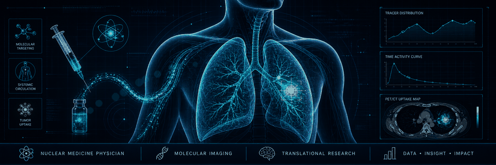

<p align="center">
  
</p>

<h1 align="center">Yongluo Jiang, M.D.</h1>

<p align="center">
  Nuclear Medicine Physician at Sun Yat-sen University Cancer Center, Guangzhou, China
</p>

<p align="center">
  <a href="https://github.com/jyluo1994">
    
  </a>
  <a href="https://github.com/jyluo1994">
    
  </a>
  <a href="https://github.com/jyluo1994">
    
  </a>
</p>

### About

I am a nuclear medicine physician and imaging biomarker researcher focusing on tumor imaging, radiomics, medical imaging deep learning, and clinically interpretable biomarkers.

My current work and learning are centered on PET/CT, PET/MR, lung cancer imaging, prognosis and treatment-response prediction, computational pathology, pathology image processing, and single-cell analysis.

> I care about research workflows that begin with real clinical questions and end with reproducible evidence, readable figures, and clinically meaningful hypotheses.

### Research Focus

| Area | Interests |
| --- | --- |
| Nuclear medicine and molecular imaging | PET/CT, PET/MR, tracer uptake, tumor metabolism, imaging phenotypes |
| Tumor imaging biomarkers | Lung cancer, nasopharyngeal carcinoma, brain metastasis, prognosis, diagnosis, treatment response |
| Radiomics and medical imaging AI | Feature engineering, segmentation, deep learning, survival prediction, model validation |
| Multimodal biomedical analysis | Radiology-pathology correlation, computational pathology, single-cell analysis, translational research |

### Currently Learning

```text
Computational pathology -> pathology image processing -> single-cell analysis
                         -> multimodal imaging biomarkers
```

### AI-Assisted Workflow

I use AI-assisted tools such as OpenClaw, Claude Code, Codex, and DeepSeek to support literature review, coding, reproducible analysis, figure preparation, manuscript drafting, and grant writing.

These tools are part of my research workflow, not a replacement for clinical reasoning, statistical rigor, or careful validation.

### Selected Keywords

`Nuclear Medicine` `PET/CT` `PET/MR` `Lung Cancer` `Tumor Imaging`
`Radiomics` `Imaging Biomarkers` `Medical Image Segmentation`
`Deep Learning` `Survival Analysis` `Computational Pathology`
`Single-cell Analysis` `AI-assisted Research`

### Connect

- Research updates: [ResearchGate](https://www.researchgate.net/profile/Yongluo_Jiang)
- Code and experiments: [github.com/jyluo1994](https://github.com/jyluo1994)
