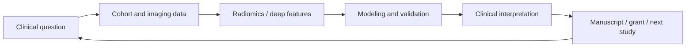

<p align="center">
  
</p>

<p align="center">
  <a href="https://github.com/jyluo1994">
    
  </a>
  <a href="https://github.com/jyluo1994">
    
  </a>
  <a href="https://github.com/jyluo1994">
    
  </a>
</p>

### Clinical questions, computational answers

I am a nuclear medicine physician at Sun Yat-sen University Cancer Center, working at the intersection of medical imaging, radiomics, deep learning, and AI-assisted scientific discovery.

My research taste is simple: start from a real clinical uncertainty, turn it into a reproducible computational workflow, and keep pushing until the output is useful for diagnosis, prognosis, treatment response, or the next experiment.

> Atypical doctor. Computational radiomics explorer. Builder of small, sharp research systems.

### Current Focus

| Direction | What I care about |
| --- | --- |
| Medical imaging AI | PET/CT, PET/MR, MRI, tumor segmentation, radiomics, habitat imaging, quantitative heterogeneity |
| Clinical prediction | Prognosis, survival modeling, treatment response, lung cancer, nasopharyngeal carcinoma, brain metastasis |
| Agentic research systems | Long-running scientific agents, recoverable workflows, literature-to-hypothesis loops, grant and manuscript automation |
| Research infrastructure | Turning scattered scripts, papers, datasets, and clinical ideas into reusable pipelines |

### Research Loop



### Active Lab Stack

| Stack | Role |
| --- | --- |
| [One Person Lab](https://github.com/jyluo1994/one-person-lab) | Personal research operating system for multi-stage scientific workflows |
| [OpenClaw Medical Skills](https://github.com/jyluo1994/OpenClaw-Medical-Skills) | Medical AI skill library and domain workflow experiments |
| [NSFC Writer](https://github.com/jyluo1994/nsfc_writer) | Local AI-assisted grant writing workflow |
| [Academic Pages](https://github.com/jyluo1994/academicpages.github.io) | Academic web presence and research notes |

### Technical Habits

```text
Clinical problem -> clean cohort -> reproducible features -> transparent model
                 -> readable figures -> auditable manuscript -> reusable workflow
```

I am most interested in tools that make scientific work less artisanal and more repeatable: small CLIs, notebooks that can become pipelines, agent runtimes that can recover from failure, and research assistants that leave an audit trail.

### Selected Interests

`PET/CT` `PET/MR` `Radiomics` `Medical Imaging` `Survival Analysis` `Deep Learning`
`LLM Agents` `Scientific Workflows` `Grant Writing` `Research Automation`

### Connect

- Research updates: [ResearchGate](https://www.researchgate.net/profile/Yongluo_Jiang)
- Code and experiments: [github.com/jyluo1994](https://github.com/jyluo1994)
